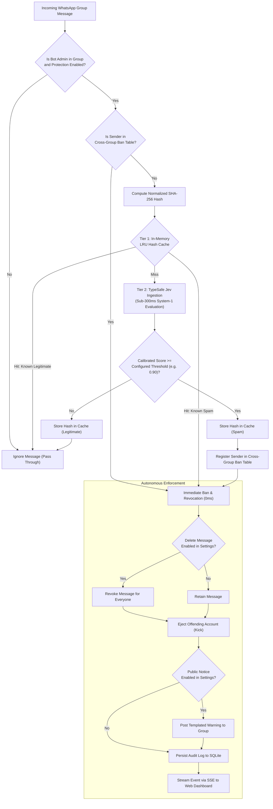

# Ban4Life

[English](README.md) | [Português](README.pt-BR.md)

Autonomous anti-spam and moderation engine for WhatsApp groups powered by TypeSafe Jev System-1 judgment primitives and zero-latency two-tier defense.

[](https://github.com/Muriel-Gasparini/ban4life/actions/workflows/ci.yml)
[](LICENSE)
[](https://www.typescriptlang.org/)
[](https://nestjs.com/)
[](https://react.dev/)
[](CONTRIBUTING.md)

---

## Overview

Managing high-velocity WhatsApp communities is inherently challenging. Automated spambots and malicious actors frequently infiltrate groups to broadcast fraudulent investment schemes, phishing links, and deceptive promotions. Because WhatsApp operates as an end-to-end encrypted messaging network without native server-side group moderation filters, group administrators must manually delete offending messages and expel attackers.

In active groups, manual intervention is too slow: members frequently view and click fraudulent links before an administrator notices. Conversely, traditional keyword blocklists and regular expressions fail against character substitutions, unicode homoglyphs, and conversational preambles.

**Ban4Life** solves this through an autonomous moderation pipeline that combines:
1. **Tier-1 Zero-Latency Cache:** An in-memory SHA-256 LRU cache that detects and neutralizes repeated broadcast attacks in `0ms` without consuming AI tokens.
2. **Tier-2 System-1 AI Judgment:** The **TypeSafe Jev** model, an atomic classification primitive executing sub-300ms evaluations with mathematically calibrated confidence scores.
3. **Cross-Group Ban Propagation:** Immediate synchronization of banned malicious actors across all communities managed by the bot.
4. **Autonomous Execution:** Immediate message revocation and participant expulsion via the WhatsApp Multi-Device protocol.
5. **Real-Time Telemetry Dashboard:** A web console streaming live moderation events via Server-Sent Events (SSE).

---

## Architectural Decision Flow

The following diagram illustrates the multi-tier evaluation pipeline executed upon message receipt:



---

## The Science of TypeSafe Jev: Why System-1 Judgment Works

A critical architectural decision in Ban4Life was rejecting traditional generative Large Language Models (LLMs) like GPT-4 or Claude for runtime message interception, opting instead for **TypeSafe Jev**.

### The Failure of Regular Expressions and Keyword Filters

Spammers employ continuous adversarial evasion techniques:
* **Character substitutions and leetspeak:** `w.h.a.t.s.a.p.p`, `p-i-x`, `clique_aqui`.
* **Unicode homoglyphs and zero-width spaces:** Inserting invisible characters between letters to break string comparisons.
* **Conversational preambles:** Masking promotional links behind benign introductions (*"Good morning everyone, does anyone know how to set up..."*).

Heuristic rules produce either debilitating false positive rates (e.g., banning software engineers discussing legitimate links) or fail entirely against novel variants.

### The Limitations of Generative LLMs

Attempting to run a generative chat model on every incoming group message introduces critical operational bottlenecks:
1. **Prohibitive Latency:** Chat models generate text token-by-token. A typical round-trip requires 1,500ms to 4,000ms. In high-traffic groups, a two-second delay allows dozens of participants to click a phishing link before it can be deleted.
2. **Uncalibrated Confidence:** Generative LLMs generate language, not probabilities. Asking a model *"Rate this from 1 to 10"* produces subjective, uncalibrated approximations prone to prompt drift.
3. **Hallucination and Schema Fragility:** Generative models frequently deviate from requested JSON formats, output explanatory preamble, or trigger internal safety refusals.
4. **Economic Unsustainability:** Processing hundreds of messages per hour across dozens of groups using multi-billion parameter generative models is financially impractical.

### Why TypeSafe Jev Excels

TypeSafe Jev is built upon the cognitive paradigm of **System 1** (Daniel Kahneman): fast, automatic, intuitive judgment. Jev is not a conversational chatbot; it is a **typed judgment primitive**.

```text
Natural Language Text + Application State  --->  [ Jev System-1 ]  --->  Typed Judgment + Calibrated Probability
```

1. **Sub-300ms Evaluation:** Jev computes semantic vector representations and outputs a classification directly, bypassing token generation. Average latency is between 180ms and 280ms.
2. **Mathematically Calibrated Probabilities:** Jev outputs a real probability $P \in [0.0, 1.0]$. A score of `0.96` represents a 96% statistical confidence that the text constitutes malicious opportunistic spam. This allows group administrators to calibrate a strict mathematical threshold via the dashboard slider (e.g., 90%).
3. **Deterministic Typed Contracts:** The API response maps directly to TypeScript types:
   * `blatant_broadcast_spam`: Opportunistic mass promotions, financial scams, phishing.
   * `soft_promotion`: Permissible self-promotion or project sharing.
   * `legitimate`: Standard conversational discourse.
4. **Adversarial Invariance:** Jev assesses the underlying semantic intent of the message rather than surface syntax, rendering character padding, homoglyphs, and link masking ineffective.
5. **Fail-Open Engineering:** The integration layer (`TypeSafeService`) enforces a strict 2,000ms execution timeout with automatic exponential retries. Under API outages, the engine defaults to `score: 0.0` (fail open), ensuring group conversations are never disrupted by external network failures.

### Comparative Analysis Matrix

| Metric / Dimension | Regular Expressions | Generative LLMs (Chat) | TypeSafe Jev (System-1) |
| :--- | :--- | :--- | :--- |
| **Response Time** | < 1ms | 1,500ms – 4,000ms | **180ms – 280ms** |
| **Obfuscation Resistance** | Ineffective | High | **High** |
| **Output Format** | Boolean match | Unstructured text / JSON | **Typed Domain Contract** |
| **Confidence Metric** | Binary (Yes / No) | Subjective text token | **Calibrated Probability ($P \in [0, 1]$)** |
| **Hallucination Risk** | None | High | **None** |
| **Evaluation Cost** | Zero | High ($0.01 – $0.03 / msg) | **Fractional (< $0.001 / msg)** |
| **Failure Mode** | Rigid bypass | Prompt injection risk | **Deterministic Fail-Open** |

---

## Two-Tier Defense Architecture

While Jev is exceptionally fast and cost-effective, evaluating repeated attacks with external AI queries remains inefficient. Attackers routinely deploy automated scripts that broadcast identical messages across multiple groups within seconds.

Ban4Life pairs Jev with an **In-Memory Two-Tier Defense Engine**:

* **Tier 1 (LRU Cache):** The engine computes a normalized `SHA-256` digest of incoming message text and consults an in-memory cache of 5,000 recent evaluations. If a match is found, the previous verdict is applied instantly in **0ms** without consuming AI tokens.
* **Tier 2 (Jev System-1):** If the digest is absent from the cache, the message passes to Jev. The resulting verdict is cached in Tier 1.
* **Cross-Group Ban Propagation:** When an account is ejected from Group A, its identifier is added to the `banned_senders` index. If that account attempts to post in Group B, it is ejected immediately upon arrival.

---

## Core System Features

* **Admin-Only Group Discovery:** The bot identifies group administrative privileges via WhatsApp metadata. Only groups where the connected account has administrator rights are displayed in the dashboard and eligible for protection.
* **Granular Protection Switches:** Administrators can toggle protection per group independently with zero downtime.
* **Configurable Actions:** Excision of spam messages can be enabled or disabled via global settings without altering the expulsion behavior.
* **Automated Notice Messaging:** Configurable public notice posted to the group upon expulsion, customizable with variable interpolation (`{user}`, `{reason}`).
* **Responsive Telemetry Dashboard:** Single-page dashboard built on React and Tailwind CSS, featuring collapsible settings, real-time SSE stream, and KPI counters.
* **Embedded Relational Storage:** Zero external database overhead. State is persisted locally via SQLite with Drizzle ORM.

---

## Repository Structure

Ban4Life is organized as a Turborepo monorepo managed with `pnpm`:

```text
ban4life/
├── apps/
│   ├── api/            # NestJS 11 backend, Baileys socket, SQLite/Drizzle, TypeSafe client
│   └── web/            # React 18 + Vite dashboard, Tailwind CSS, SSE client
├── packages/
│   ├── types/          # Shared domain contracts, DTOs, SSE event schemas
│   └── tsconfig/       # Base TypeScript configurations
├── docs/
│   └── adr/            # Architecture Decision Records (ADRs)
├── docker-compose.yml  # Production deployment configuration
├── Dockerfile          # Multi-stage production container build
├── LICENSE             # MIT License
├── CONTRIBUTING.md     # Development setup, branching, Conventional Commits
└── SECURITY.md         # Vulnerability reporting procedures
```

---

## Quickstart

### 1. Clone Repository and Configure Environment

```bash
git clone https://github.com/Muriel-Gasparini/ban4life.git
cd ban4life
cp .env.example .env
```

Edit `.env` to configure your credentials:

```dotenv
PORT=3000
ADMIN_PASSWORD=your_secure_dashboard_password
JWT_SECRET=your_jwt_signing_secret_min_32_chars
TYPESAFE_API_KEY=your_typesafe_api_key_here
DATA_DIR=./data
```

### 2. Launch the Application

#### Option A: Docker Compose via pnpm (Recommended for Production)

The repository provides automated pnpm scripts that automatically inject your `.env` file:

```bash
# Start containers in background with build and automatic .env injection
pnpm docker:up

# Follow container logs
pnpm docker:logs

# Stop containers
pnpm docker:down
```

#### Option B: Local Monorepo Execution

```bash
# Install dependencies across all workspaces
pnpm install

# Build shared packages and frontend
pnpm build

# Start the application
pnpm dev
```

The unified dashboard and API will be live at `http://localhost:3000`.

### 3. Pair WhatsApp and Activate Protection

1. Navigate to `http://localhost:3000` in your browser.
2. Authenticate using the `ADMIN_PASSWORD` defined in your `.env` file.
3. If not already paired, a QR Code modal will appear. Scan the code using WhatsApp on your mobile device (**Linked Devices > Link a Device**).
4. Upon successful pairing, the dashboard will list all WhatsApp groups where your connected account is an administrator.
5. Toggle the switches to activate protection on desired groups.

---

## Configuration Reference

| Environment Variable | Required | Default | Description |
| :--- | :--- | :--- | :--- |
| `PORT` | No | `3000` | Port on which the API and dashboard are served. |
| `ADMIN_PASSWORD` | Yes | — | Password used to authenticate into the web dashboard. |
| `JWT_SECRET` | Yes | — | Secret key used to sign and verify administrative JWT tokens. |
| `TYPESAFE_API_KEY` | Recommended | — | TypeSafe API key for Jev evaluations. If omitted, mock heuristics are used. |
| `DATA_DIR` | No | `./data` | Directory where SQLite database and WhatsApp session keys are stored. |

---

## Architecture Decision Records (ADRs)

Key technical choices are formally documented in the [ADR Index](docs/adr/README.md):

* [ADR-0001: Monorepo Structure with Turborepo and pnpm](docs/adr/0001-monorepo-structure-with-turborepo-and-pnpm.md)
* [ADR-0002: TypeSafe Jev System-1 Judgment Primitive](docs/adr/0002-typesafe-jev-system-1-judgment-primitive.md)
* [ADR-0003: WhatsApp Multi-Device Protocol via Baileys](docs/adr/0003-baileys-whatsapp-multi-device-integration.md)
* [ADR-0004: In-Memory Two-Tier Defense Engine](docs/adr/0004-two-tier-defense-lru-cache-and-cross-group-ban.md)
* [ADR-0005: Embedded Storage with SQLite and Drizzle ORM](docs/adr/0005-embedded-storage-with-sqlite-and-drizzle-orm.md)
* [ADR-0006: Server-Sent Events (SSE) for Real-Time Telemetry](docs/adr/0006-server-sent-events-for-realtime-telemetry.md)

---

## Contributing and Governance

Contributions are welcome. Please read [CONTRIBUTING.md](CONTRIBUTING.md) for details on our code of conduct, development setup, and the Conventional Commits specification.

For repository branch policies and pull request requirements, consult [CONTRIBUTING.md](CONTRIBUTING.md).

---

## License

This project is licensed under the terms of the [MIT License](LICENSE).
