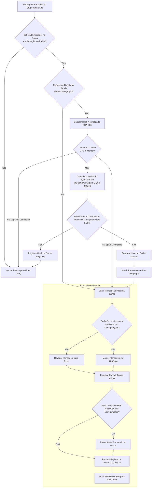

# Ban4Life

[English](README.md) | [Português](README.pt-BR.md)

Motor autônomo de moderação e proteção anti-spam para grupos de WhatsApp fundamentado em primitivas de julgamento TypeSafe Jev (System-1) e arquitetura de defesa em duas camadas com latência zero.

[](https://github.com/Muriel-Gasparini/ban4life/actions/workflows/ci.yml)
[](LICENSE)
[](https://www.typescriptlang.org/)
[](https://nestjs.com/)
[](https://react.dev/)
[](CONTRIBUTING.md)

---

## Visão Geral

A administração de comunidades de alto fluxo no WhatsApp apresenta desafios operacionais contínuos. Contas automatizadas e criminosos digitais infiltram-se frequentemente em grupos para disseminar golpes financeiros, esquemas de pirâmide, links de phishing e conteúdo malicioso. Como o WhatsApp opera sob criptografia ponta a ponta sem filtros nativos de moderação em nível de servidor, administradores dependem de intervenções manuais para apagar mensagens e expulsar invasores.

Em comunidades ativas, a moderação manual é inviável: dezenas de membros visualizam e clicam em links fraudulentos antes que um moderador humano perceba a intrusão. Por outro lado, soluções baseadas em listas estáticas de palavras-chave e expressões regulares falham diante de ofuscações, homóglifos unicode e abordagens contextuais disfarçadas.

O **Ban4Life** resolve esse problema por meio de um pipeline autônomo composto por:
1. **Camada 1 (Cache In-Memory 0ms):** Cache LRU indexado por SHA-256 que intercepta e neutraliza ataques de disparo em massa repetidos em `0ms` sem consumo de tokens de inteligência artificial.
2. **Camada 2 (Julgamento System-1):** O modelo **TypeSafe Jev**, uma primitiva de classificação atômica executada em menos de 300ms com probabilidades matemáticas calibradas.
3. **Propagação de Ban Intergrupal:** Sincronização imediata de invasores expulsos em todos os grupos administrados pelo bot.
4. **Execução Autônoma:** Exclusão sumária da mensagem e expulsão do membro infrator via protocolo WhatsApp Multi-Device.
5. **Telemetria em Tempo Real:** Painel web responsivo com streaming de eventos via Server-Sent Events (SSE).

---

## Fluxo de Decisão Arquitetural

O diagrama a seguir descreve o fluxo de avaliação executado para cada mensagem recebida:



---

## A Ciência do TypeSafe Jev: Por que o Modelo System-1 Funciona

Uma decisão de engenharia fundamental no Ban4Life foi recusar o uso de Modelos de Linguagem Generativos tradicionais (LLMs como GPT-4, Claude ou Gemini em modo chat) para a moderação em tempo real, optando pela arquitetura **TypeSafe Jev**.

### O Esgotamento das Expressões Regulares (Regex)

Atacantes automatizados utilizam técnicas contínuas de evasão adversarial:
* **Substituições de caracteres e leetspeak:** `w.h.a.t.s.a.p.p`, `p-i-x`, `r-e-n-d-a-f-a-c-i-l`.
* **Homóglifos Unicode e espaços de largura zero:** Inserção de caracteres invisíveis entre letras para quebrar comparadores de texto puro.
* **Preâmbulos conversacionais disfarçados:** Ocultamento de links maliciosos atrás de mensagens aparentemente inocentes (*"Bom dia pessoal, alguém aqui entende de investimentos?"*).

Regras heurísticas produzem taxas inaceitáveis de falsos positivos (como banir desenvolvedores compartilhando links técnicos legítimos) ou falham por completo diante de variações inéditas.

### As Limitações dos LLMs Generativos Tradicionais

Executar um modelo conversacional generativo para cada mensagem recebida em dezenas de grupos impõe barreiras críticas:
1. **Latência Proibitiva:** Modelos generativos geram texto token por token. Uma resposta típica demora entre 1.500ms e 4.000ms. Em grupos ativos, esse atraso permite que dezenas de membros cliquem no link antes da exclusão.
2. **Confiança Não Calibrada:** LLMs generativos produzem linguagem verbal, não probabilidades matemáticas. Solicitar *"avalie de 1 a 10"* gera aproximações subjetivas sensíveis à formulação do prompt.
3. **Alucinações e Fragilidade de Esquema:** Modelos conversacionais podem violar a formatação JSON esperada, emitir preâmbulos explicativos indesejados ou recusar respostas com base em filtros internos genéricos.
4. **Custo Operacional Inviável:** Avaliar milhares de mensagens por dia em dezenas de comunidades consumindo bilhões de parâmetros em LLMs comerciais é financeiramente insustentável.

### Por que o TypeSafe Jev se Destaca

O TypeSafe Jev baseia-se no conceito de **Sistema 1** (Daniel Kahneman): julgamento rápido, automático e intuitivo. O Jev não é um chatbot conversacional; é uma **primitiva tipada de julgamento**.

```text
Texto em Linguagem Natural + Estado da Aplicação  --->  [ Jev System-1 ]  --->  Julgamento Tipado + Probabilidade Calibrada
```

1. **Inferência Sub-300ms:** O Jev analisa a representação vetorial semântica e emite a classificação diretamente, sem passar por geração de texto. A latência média varia entre 180ms e 280ms.
2. **Probabilidades Matematicamente Calibradas:** O retorno do Jev é uma probabilidade real $P \in [0.0, 1.0]$. Uma pontuação de `0.96` indica 96% de certeza estatística de que o texto representa spam predatório. Isso permite que o administrador calibre um limiar de corte rígido no slider do painel (ex: 90%).
3. **Contratos Tipados Determinísticos:** A resposta do modelo mapeia diretamente para contratos TypeScript:
   * `blatant_broadcast_spam`: Golpes financeiros, pirâmides, phishing e spam de broadcast ostensivo.
   * `soft_promotion`: Autopromoção moderada ou divulgação permitida.
   * `legitimate`: Diálogo conversacional comunitário normal.
4. **Imunidade Adversarial Semântica:** O Jev avalia a intenção semântica profunda da mensagem, e não a sintaxe superficial. Substituições de caracteres, homóglifos e encurtadores de links tornam-se ineficazes contra a avaliação.
5. **Arquitetura com Falha Segura (Fail-Open):** A camada de integração (`TypeSafeService`) implementa retentativas com backoff exponencial e timeout de 2.000ms. Em caso de indisponibilidade externa, o serviço adota **falha aberta** (`score: 0.0`), garantindo que o fluxo normal de mensagens dos usuários nunca seja bloqueado por falhas de infraestrutura.

### Matriz Comparativa

| Dimensão Técnica | Expressões Regulares | LLMs Generativos (Chat) | TypeSafe Jev (System-1) |
| :--- | :--- | :--- | :--- |
| **Tempo Médio de Resposta** | < 1ms | 1.500ms – 4.000ms | **180ms – 280ms** |
| **Resistência a Ofuscação** | Nula | Alta | **Alta** |
| **Formato de Saída** | Boolean match | Texto livre / JSON frágil | **Contrato Tipado Determinístico** |
| **Métrica de Certeza** | Binária (Sim / Não) | Texto subjetivo | **Probabilidade Calibrada ($P \in [0, 1]$)** |
| **Risco de Alucinação** | Inexistente | Alto | **Inexistente** |
| **Custo por Avaliação** | Zero | Elevado ($0,01 – $0,03 / msg) | **Fracionário (< $0,001 / msg)** |
| **Resiliência a Falhas** | Rígida / Bypass fácil | Risco de injeção de prompt | **Falha Aberta Segura (Fail-Open)** |

---

## Arquitetura de Defesa em Duas Camadas

Embora o Jev seja extremamente rápido e econômico, avaliar ataques repetidos em serviços externos continuaria consumindo latência e recursos desnecessários. Frequentemente, spammers utilizam bots que enviam o mesmo texto para 10 a 50 grupos simultaneamente em menos de 1 minuto.

O Ban4Life combina o Jev com um **Motor In-Memory de Duas Camadas**:

* **Camada 1 (Cache LRU Hash):** O bot calcula o digest `SHA-256` normalizado do texto da mensagem e consulta um cache local de 5.000 entradas recentes. Se houver correspondência, o veredito anterior é aplicado em **0ms** com zero chamadas de API e zero queries de banco.
* **Camada 2 (TypeSafe Jev):** Caso o hash não conste no cache, a mensagem é submetida ao Jev. O veredito retornado é armazenado na Camada 1 para reutilização imediata.
* **Propagação de Ban Intergrupal:** Ao expulsar um infrator do Grupo A, seu identificador é adicionado à lista de banimento intergrupal. Se esse mesmo número postar no Grupo B, será sumariamente banido no ato da chegada.

---

## Recursos Principais do Sistema

* **Descoberta Exclusiva de Grupos Administrados:** O bot inspeciona os metadados do WhatsApp e exibe na interface exclusivamente os grupos onde o número conectado possui privilégios de administrador, evitando tentativas de moderação sem permissão.
* **Controles Granulares por Grupo:** Ativação e desativação independente da proteção por grupo com feedback visual instantâneo.
* **Ação de Exclusão Configurável:** Possibilidade de desativar a exclusão da mensagem física caso a administração prefira manter a evidência no histórico do chat, mantendo a expulsão da conta.
* **Avisos Públicos de Banimento Automatizados:** Envio opcional de mensagem explicativa no grupo após o ban, com suporte a variáveis dinâmicas (`{user}`, `{reason}`).
* **Painel de Telemetria com Drawer de Configurações:** Interface single-page moderna construída em React, Tailwind CSS e Server-Sent Events (SSE).
* **Armazenamento Embutido em SQLite e Drizzle ORM:** Totalmente autônomo, sem necessidade de servidores externos de banco de dados ou migrações manuais.

---

## Estrutura do Repositório

O Ban4Life adota monorepo gerenciado com Turborepo e `pnpm`:

```text
ban4life/
├── apps/
│   ├── api/            # Backend NestJS 11, Baileys socket, SQLite/Drizzle, TypeSafe
│   └── web/            # Frontend React 18, Vite, Tailwind CSS, cliente SSE
├── packages/
│   ├── types/          # Contratos TypeScript de domínio, DTOs e eventos SSE
│   └── tsconfig/       # Configurações base do compilador TypeScript
├── docs/
│   └── adr/            # Registros de Decisão de Arquitetura (ADRs)
├── docker-compose.yml  # Configuração de deploy em container
├── Dockerfile          # Build multi-stage de produção
├── LICENSE             # Licença MIT
├── CONTRIBUTING.md     # Guia de contribuição e convenção de commits
└── SECURITY.md         # Procedimento de reporte de vulnerabilidades
```

---

## Início Rápido

### 1. Clonar Repositório e Configurar Variáveis de Ambiente

```bash
git clone https://github.com/Muriel-Gasparini/ban4life.git
cd ban4life
cp .env.example .env
```

Edite o arquivo `.env` com suas credenciais:

```dotenv
PORT=3000
ADMIN_PASSWORD=sua_senha_segura_do_painel
JWT_SECRET=seu_segredo_jwt_com_pelo_menos_32_caracteres
TYPESAFE_API_KEY=sua_chave_de_api_typesafe
DATA_DIR=./data
```

### 2. Iniciar a Aplicação

#### Opção A: Docker Compose via pnpm (Recomendado para Produção)

O repositório já inclui scripts pnpm prontos que injetam o arquivo `.env` automaticamente:

```bash
# Iniciar containers em background com build e injeção automática do .env
pnpm docker:up

# Acompanhar logs em tempo real
pnpm docker:logs

# Parar os containers
pnpm docker:down
```

#### Opção B: Execução Local no Monorepo

```bash
# Instalar dependências em todos os workspaces
pnpm install

# Compilar pacotes compartilhados e frontend
pnpm build

# Iniciar o servidor unificado
pnpm dev
```

O painel unificado e a API estarão operacionais em `http://localhost:3000`.

### 3. Parear WhatsApp e Ativar Proteção

1. Acesse `http://localhost:3000` no seu navegador.
2. Faça login informando a senha configurada em `ADMIN_PASSWORD`.
3. Caso a sessão não esteja pareada, o modal de QR Code será exibido automaticamente. Abra o WhatsApp no celular e escaneie o código (**Aparelhos conectados > Conectar um aparelho**).
4. Após o pareamento, o painel listará os grupos onde o bot é administrador.
5. Ative os switches para habilitar a proteção em tempo real nos grupos desejados.

---

## Referência de Variáveis de Ambiente

| Variável | Obrigatória | Valor Padrão | Descrição |
| :--- | :--- | :--- | :--- |
| `PORT` | Não | `3000` | Porta onde o backend e o painel web são servidos. |
| `ADMIN_PASSWORD` | Sim | — | Senha de autenticação do painel de administração. |
| `JWT_SECRET` | Sim | — | Segredo criptográfico para geração e validação de tokens JWT. |
| `TYPESAFE_API_KEY` | Recomendada | — | Chave de API TypeSafe para avaliação do Jev. Se ausente, usa fallback mock. |
| `DATA_DIR` | Não | `./data` | Diretório onde o banco SQLite e as chaves de sessão são persistidos. |

---

## Registros de Decisão de Arquitetura (ADRs)

Decisões de engenharia estruturantes estão formalmente documentadas no [Índice de ADRs](docs/adr/README.md):

* [ADR-0001: Estrutura de Monorepo com Turborepo e pnpm](docs/adr/0001-monorepo-structure-with-turborepo-and-pnpm.md)
* [ADR-0002: Primitiva de Julgamento TypeSafe Jev (System-1)](docs/adr/0002-typesafe-jev-system-1-judgment-primitive.md)
* [ADR-0003: Integração com WhatsApp Multi-Device via Baileys](docs/adr/0003-baileys-whatsapp-multi-device-integration.md)
* [ADR-0004: Defesa em Duas Camadas com Cache LRU e Ban Intergrupal](docs/adr/0004-two-tier-defense-lru-cache-and-cross-group-ban.md)
* [ADR-0005: Armazenamento Embutido com SQLite e Drizzle ORM](docs/adr/0005-embedded-storage-with-sqlite-and-drizzle-orm.md)
* [ADR-0006: Server-Sent Events (SSE) para Telemetria em Tempo Real](docs/adr/0006-server-sent-events-for-realtime-telemetry.md)

---

## Contribuição e Governança

Contribuições da comunidade são muito bem-vindas. Consulte o [CONTRIBUTING.md](CONTRIBUTING.md) para detalhes sobre configuração do ambiente de desenvolvimento, code style e a especificação de Conventional Commits.

Para diretrizes de governança de branches e pull requests, consulte [CONTRIBUTING.md](CONTRIBUTING.md).

---

## Licença

Este projeto é distribuído sob os termos da [Licença MIT](LICENSE).
