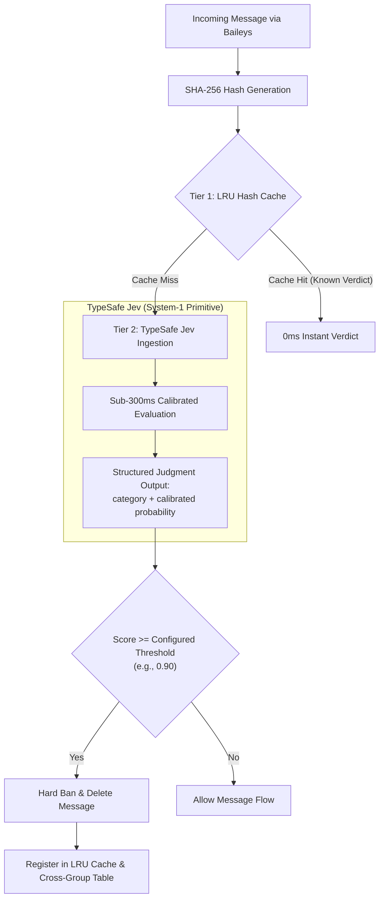

# ADR-0002: TypeSafe Jev System-1 Judgment Primitive for Spam Moderation

## Status

Accepted

## Context

WhatsApp groups with hundreds of active members are frequent targets for automated broadcast attacks: phishing schemes, fraudulent investment opportunities, pyramid scams, and illicit link distribution. Moderating these groups requires evaluating hundreds of messages per minute under strict operational requirements:

1. **Sub-second latency:** A spam message remaining visible for more than 1 to 2 seconds allows multiple participants to view or click malicious links before revocation.
2. **Obfuscation resistance:** Attackers actively bypass keyword filters using Unicode homoglyphs, zero-width characters, spaced text, phonetic variations, and disguised redirects.
3. **High precision (Zero False Positives):** Wrongfully ejecting legitimate group participants or community leaders destroys trust in group administration.
4. **Economic viability:** Processing thousands of messages across dozens of groups must remain financially sustainable.

### Alternatives Considered

#### Option A: Regular Expressions and Heuristic Keyword Blocklists
* **Mechanism:** Matching incoming message strings against curated lists of regex patterns, suspicious domains, and telephone numbers.
* **Limitations:** Spammers mutate payloads continuously (`t.me/`, `wa.me/`, character substitutions like `p-i-x` or `wh4ts4pp`). Regular expressions suffer from high maintenance overhead, high false positive rates on benign technical discussions, and near-zero efficacy against nuanced social engineering.

#### Option B: Traditional Generative LLMs (OpenAI GPT-4, Claude, Gemini via Chat APIs)
* **Mechanism:** Sending prompts instructing the LLM to analyze the message and output JSON containing a decision and reason.
* **Limitations:**
  * **Excessive Latency:** Generative chat round-trips require 1,500ms to 4,000ms, too slow to prevent user clicks in active groups.
  * **Cost Inefficiency:** Prompt formatting, system instructions, and tokenized chat generation result in high cost per message evaluation.
  * **Uncalibrated Confidence:** Generative models output conversational tokens rather than mathematically calibrated probabilities. Prompt-and-parse pipelines are susceptible to hallucinations, schema violations, and prompt injections.

#### Option C: TypeSafe Jev (System-1 Judgment Primitive)
* **Mechanism:** Small, specialized AI units that operate as programming primitives. Modeled after Daniel Kahneman's "System 1" cognitive concept (fast, intuitive, automatic judgment), Jev evaluates natural language and application state, returning typed judgment classifications and calibrated probability distributions ($P \in [0.0, 1.0]$) in sub-300ms.

## Decision

We adopt **TypeSafe Jev** as the core AI judgment engine in Ban4Life.

### Architectural Properties of TypeSafe Jev in Ban4Life

1. **Mathematically Calibrated Probability:** Jev does not return arbitrary ratings. Its score represents an empirical confidence probability ($0.0$ to $1.0$). If an administrator configures a threshold of `0.90`, the system guarantees that action is taken only when the model's confidence exceeds 90%.
2. **Sub-300ms Inference:** Jev bypasses text token generation entirely. It directly computes semantic classification, executing in an average of 180ms to 280ms.
3. **Deterministic Categorization:** Judgments map cleanly to strongly-typed TypeScript domain contracts:
   * `blatant_broadcast_spam`: Aggressive opportunistic spam, pyramid schemes, phishing.
   * `soft_promotion`: Mild advertising, self-promotion.
   * `legitimate`: Normal community conversation.
4. **Resilience & Fail-Open Philosophy:** The `TypeSafeService` wraps Jev calls in a retry loop with exponential backoff and a hard 2,000ms timeout. If an API disruption occurs, the service **fails open** (`score: 0.0, category: 'legitimate'`), ensuring that group communication is never blocked by external infrastructure failures.

## Comparative Matrix

| Evaluation Dimension | Regular Expressions | Generative LLMs (GPT-4 / Claude) | TypeSafe Jev (System-1) |
| :--- | :--- | :--- | :--- |
| **Average Latency** | < 1ms | 1,500ms – 4,000ms | **150ms – 300ms** |
| **Obfuscation Resistance** | Poor (trivial to bypass) | High | **High** |
| **Output Type** | Boolean match | Unstructured / JSON text tokens | **Typed Calibrated Probability** |
| **Hallucination Risk** | Zero | Moderate to High | **Zero** |
| **Operational Cost** | Negligible | High ($0.01 – $0.03 / evaluation) | **Fractional (< $0.001 / evaluation)** |
| **Threshold Customization** | Binary (Match / No Match) | Subjective prompt tuning | **Continuous Float ($P \in [0.0, 1.0]$)** |

## Consequences

### Positive

* **Instantaneous Interception:** Spam messages are detected and removed within fractions of a second, preventing member exposure.
* **Deterministic Governance:** Administrators have full mathematical control over moderation strictness through the UI threshold slider.
* **Zero Hallucination Surface:** No conversational text is generated, eliminating risk of bot arguing with users or generating offensive content.

### Negative / Trade-offs

* **External Dependency:** Requires network connectivity to the TypeSafe judgment endpoint. Mitigated by the local Tier-1 SHA-256 LRU cache and the fail-open fallback mechanism.
