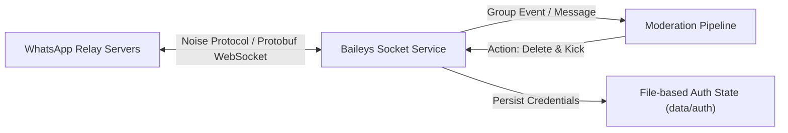

# ADR-0003: WhatsApp Multi-Device Protocol via Baileys Socket

## Status

Accepted

## Context

Ban4Life must connect to WhatsApp to monitor group conversations in real time, inspect message content, detect admin status transitions, revoke malicious messages, and expel spam accounts.

### Alternatives Considered

#### Option A: Official Meta WhatsApp Business Cloud API
* **Limitations:** The official WhatsApp Business Platform API is engineered for 1-to-1 customer support and transactional outbound messaging. It does not provide endpoints to join arbitrary community groups, listen to peer-to-peer group streams, delete messages sent by other participants, or execute administrative removals (`kick`).

#### Option B: Headless Browser Automation (Puppeteer / Chromium / WPPConnect)
* **Limitations:** Driving WhatsApp Web through automated headless Chromium instances requires massive system memory (500MB to 1.5GB of RAM per process), high CPU overhead, and is fragile against frontend DOM mutations deployed by WhatsApp Web engineers.

#### Option C: Baileys (Native Multi-Device WebSocket Protocol)
* **Mechanism:** A pure TypeScript implementation of WhatsApp's binary WebSocket multi-device protocol. Connects directly to WhatsApp relay servers using Noise encryption protocol and Protocol Buffers.

## Decision

We adopt **Baileys** (`@whiskeysockets/baileys`) as the core WhatsApp integration layer.

### Architectural Key Points

1. **Lightweight Footprint:** Operates in a pure Node.js runtime without browser dependencies, consuming less than 60MB of RAM under active operation.
2. **Comprehensive Group Privileges:** Supports all administrative socket commands:
   * `groupParticipantsUpdate(jid, [sender], 'remove')`
   * `sendMessage(jid, { delete: messageKey })`
   * `groupMetadata(jid)` for administrator discovery.
3. **Session Persistence:** Authenticated session keys and pre-keys are written to the local encrypted directory (`data/auth`), surviving application restarts and container rebuilds.
4. **Resilient Error Handling:** Explicit interception of WhatsApp server responses (`403 forbidden`, `404 item-not-found`) when the bot leaves or is removed from a group, preventing crashes and suppressing spurious log errors.

## Consequences

### Positive

* **Full Group Autonomy:** Enables instant deletion of abusive messages and removal of attackers.
* **Low Resource Utilization:** Allows the entire monorepo (API + Web + Bot) to run effortlessly inside a minimal container (e.g., 512MB RAM VPS).
* **Independent Authentication:** Simple QR-code pairing via browser dashboard without complex Meta Business verification procedures.

### Negative / Trade-offs

* **Unofficial Protocol Risk:** Baileys relies on reverse-engineered protocols. Protocol updates by WhatsApp may require library patch updates. Mitigated by isolating Baileys logic inside a dedicated NestJS module (`BaileysModule`).
