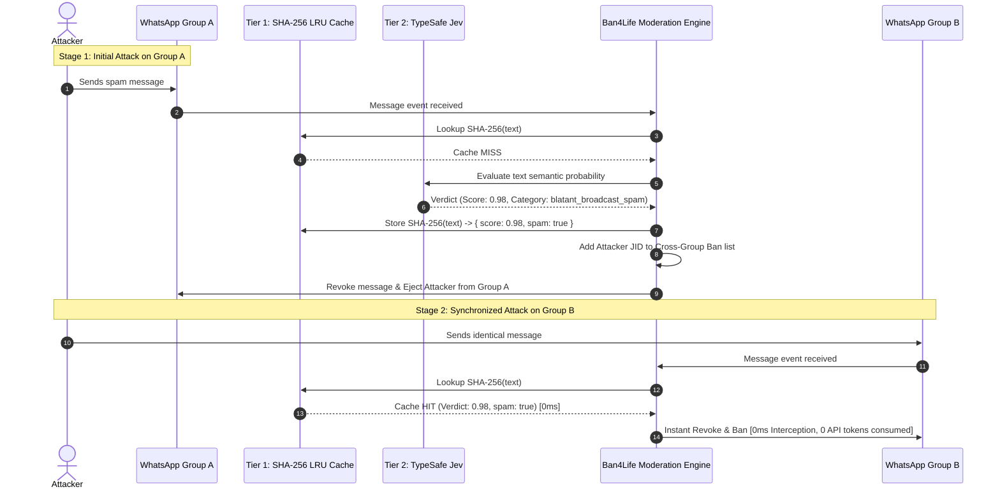

# ADR-0004: In-Memory Two-Tier Defense (LRU Cache & Cross-Group Ban)

## Status

Accepted

## Context

Attackers targeting WhatsApp communities rarely attack a single group in isolation. Instead, automated botnets join multiple groups managed by the same administrator and broadcast identical promotional payloads or phishing links simultaneously within seconds.

If each identical broadcast message required an external API judgment call to TypeSafe Jev:
1. Latency would accumulate across concurrent group events.
2. Unnecessary API token consumption would occur for identical text payloads.
3. Attackers might succeed in posting in secondary groups before the first judgment completes.

## Decision

We implement a **Two-Tier In-Memory Defense Engine** combined with an automated **Cross-Group Ban Propagation Table**.

### Technical Specification

1. **Tier 1: High-Performance SHA-256 LRU Cache (`CacheService`)**
   * **Key:** `SHA-256(normalized_text)`
   * **Capacity:** 5,000 recent evaluations managed with Least Recently Used (LRU) eviction.
   * **Hit Execution Time:** `< 0.1ms` (zero network I/O, zero database queries).
   * **Persistence:** Keeps recent verdicts for both positive spams and confirmed legitimate messages.

2. **Cross-Group Ban Tracking (`banned_senders` Table & In-Memory Index)**
   * When an account is ejected from any managed group for severe spam, their unique JID is marked in the system.
   * If the account attempts to message another group where Ban4Life is active, the bot triggers an immediate ejection without re-evaluating innocence.

## Consequences

### Positive

* **0ms Latency for Broadcast Floods:** Duplicate messages sent across multiple groups are intercepted instantaneously.
* **Massive Token Economics:** Typical automated campaigns send identical messages 10 to 50 times. Tier 1 eliminates 90% to 98% of API evaluation costs during active attacks.
* **Proactive Group Immunity:** Banning a bad actor in Group A protects Groups B, C, and D before the actor even attempts to post there.

### Negative / Trade-offs

* **Text Variation Bypass:** If an attacker modifies characters between groups, the SHA-256 hash will differ, triggering Tier 2 (Jev evaluation). Jev's semantic analysis handles the variant, adding the new hash to Tier 1.
