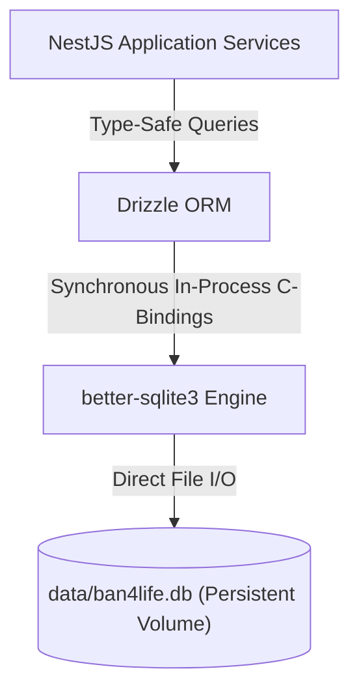

# ADR-0005: Embedded Relational Storage with SQLite and Drizzle ORM

## Status

Accepted

## Context

Ban4Life requires persistent storage for:
1. Managed WhatsApp groups and their active protection toggles.
2. Historical audit logs of intercepted spams and expelled users.
3. System configuration settings (deletion toggle, public notice messages, Jev sensitivity threshold).
4. Cross-group banned sender identifiers.

### Alternatives Considered

#### Option A: External Relational Database (PostgreSQL / MySQL)
* **Limitations:** Running PostgreSQL or MySQL requires a separate database service or container, dedicated connection pool management, and increased operational maintenance for self-hosters. For a group management bot, network latency between the app and an external DB adds unnecessary overhead.

#### Option B: Document Stores (MongoDB / Redis)
* **Limitations:** Moderation logs and group relationships are fundamentally relational. Key-value stores lack native SQL query capabilities for audit filtering and metric aggregation.

#### Option C: Embedded SQLite via `better-sqlite3` + Drizzle ORM
* **Mechanism:** SQLite executes directly within the Node.js process using native synchronous C bindings. Drizzle ORM provides a zero-overhead, type-safe query builder and schema management layer.

## Decision

We adopt **SQLite** with **better-sqlite3** and **Drizzle ORM**.

### Architectural Key Points

1. **Zero External Dependencies:** The application requires no database servers, credentials, or network socket setups. A single Docker volume mount (`./data:/app/data`) guarantees complete state persistence.
2. **Synchronous In-Memory Performance:** `better-sqlite3` performs reads and writes in sub-millisecond timeframes directly in the process memory space.
3. **Strict Type Safety:** Schema definitions in `schema.ts` export TypeScript types directly used throughout services and controllers.
4. **Resilient Auto-Migration:** Database initialization scripts automatically execute required table and column additions (e.g. `is_bot_admin`) on startup without manual migration scripts.

## Consequences

### Positive

* **Simplicity of Self-Hosting:** Users can run Ban4Life with a single command (`docker compose up -d`) with zero database provisioning.
* **Trivial Backup Strategy:** Backing up or migrating the database requires copying a single file (`data/ban4life.db`).
* **High Query Speed:** Complex log queries and metrics aggregation complete in single-digit milliseconds.

### Negative / Trade-offs

* **Single-Process Constraint:** SQLite is optimized for single-process architectures. If horizontal scaling across multiple container replicas were required in the future, a migration to an external database would be necessary. For Ban4Life's single-socket WhatsApp bot architecture, a single process is the optimal design.
