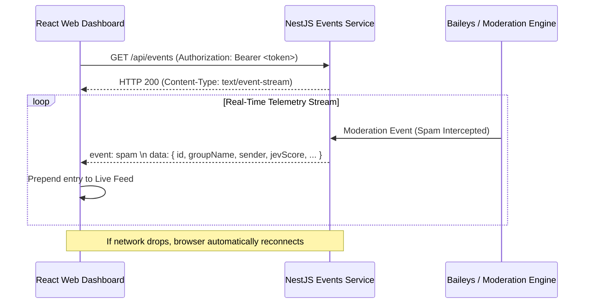

# ADR-0006: Server-Sent Events (SSE) for Unidirectional Dashboard Telemetry

## Status

Accepted

## Context

The Ban4Life web dashboard requires real-time telemetry updates:
1. Live streaming of intercepted spam messages, Jev confidence scores, and ban actions.
2. Immediate reflection of WhatsApp connection status (e.g. `connecting`, `waiting_qr`, `connected`).
3. Real-time state synchronization when groups are protected, promoted, or demoted.

### Alternatives Considered

#### Option A: HTTP Short / Long Polling
* **Limitations:** Periodic polling introduces artificial latency (e.g., 2 to 5 seconds delay) and generates constant unnecessary HTTP requests and database queries even when no moderation events occur.

#### Option B: Full-Duplex WebSockets
* **Limitations:** WebSockets establish a custom bidirectional protocol (`ws://` / `wss://`). They require custom connection state management, heartbeat ping-pong intervals, and complex authentication renegotiation. Furthermore, enterprise firewalls and corporate proxies frequently block or terminate long-lived WebSocket upgrade requests.

#### Option C: Server-Sent Events (SSE)
* **Mechanism:** A standardized W3C specification where the browser opens a persistent HTTP connection (`text/event-stream`), and the server pushes text-based event packets down the stream.

## Decision

We adopt **Server-Sent Events (SSE)** via NestJS (`@Sse('api/events')`) and standard browser `EventSource`.

### Architectural Key Points

1. **Unidirectional Alignment:** Ban4Life's live telemetry is inherently unidirectional (server pushing events to browser). Client mutations (updating settings, toggling groups) are standard REST requests (`PATCH /api/settings`, `POST /api/groups/:id/toggle`), which provide explicit status codes and error handling.
2. **Native Reconnection:** The browser's native `EventSource` handles reconnection and network loss transparently without custom JavaScript polling loops.
3. **HTTP/2 Compatibility:** Operates natively over standard HTTP ports (80/443), passing seamlessly through reverse proxies (Nginx, Traefik, Caddy, Cloudflare) with simple `X-Accel-Buffering: no` headers.

## Consequences

### Positive

* **Minimal Complexity:** Zero external WebSocket libraries or state machines required on the client.
* **Instantaneous Telemetry:** Dashboard updates occur within single-digit milliseconds of a ban event.
* **Low Server Overhead:** A single HTTP stream per authenticated dashboard tab with minimal memory footprint.

### Negative / Trade-offs

* **Text-Only Stream:** SSE natively streams UTF-8 text. Binary payloads would require base64 encoding. For JSON telemetry payloads, UTF-8 text is optimal.
